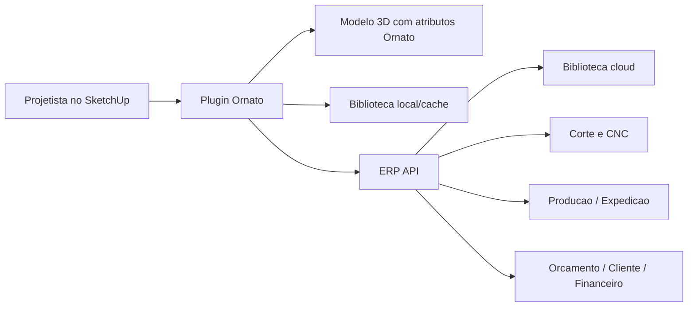

# Ornato - Leia primeiro

Este documento e o mapa de entrada do sistema Ornato. Ele explica onde esta cada coisa, para que serve cada pasta, como o ERP conversa com o plugin SketchUp e quais arquivos um dev deve abrir primeiro antes de mexer.

Data da auditoria: 2026-05-11.

## A ideia em uma frase

O Ornato tem duas partes principais dentro da mesma pasta:

```txt
/Users/madeira/SISTEMA NOVO
├── src/                 # site/ERP - frontend React
├── server/              # site/ERP - API Express + SQLite
└── ornato-plugin/       # plugin SketchUp - Ruby + HtmlDialog
```

O ERP cuida de venda, cliente, orcamento, producao, CNC, estoque, financeiro, biblioteca cloud e atualizacao do plugin. O plugin SketchUp cuida de desenho tecnico, leitura do modelo 3D, biblioteca de blocos, ferragens, usinagens, validacao e exportacao para o ERP/CNC.

## O que abrir primeiro

| Se voce quer entender | Comece por |
|---|---|
| Visao geral do monorepo | `docs/01_ARQUITETURA_MONOREPO_ORNATO.md` |
| Site/ERP, backend, rotas, banco | `docs/02_ERP_SITE_BACKEND.md` |
| Plugin SketchUp, Ruby, UI v2, miras | `docs/03_PLUGIN_SKETCHUP.md` |
| Biblioteca cloud, blocos, WPS, SKP/JSON | `docs/04_BIBLIOTECA_CLOUD_E_BLOCOS.md` |
| Riscos, pontos fortes, pendencias tecnicas | `docs/05_AUDITORIA_TECNICA_E_RISCOS.md` |
| Como rodar, testar, buildar e mexer sem quebrar | `docs/06_GUIA_DEV_OPERACIONAL.md` |

## Glossario sem enrolacao

| Termo | O que significa |
|---|---|
| ERP | O sistema web. E o site que roda em React/Express e guarda dados no SQLite. |
| Plugin | Extensao do SketchUp. Fica em `ornato-plugin/`. |
| HtmlDialog | Janela HTML que aparece dentro do SketchUp. A UI v2 do plugin usa isso. |
| Modulo | Um movel principal: balcao, aereo, torre, armario etc. |
| Agregado | Algo inserido dentro ou junto de um modulo: gaveteiro, prateleira, painel ripado, kit interno etc. |
| Peca | Chapa individual que sera cortada/usada na producao: lateral, base, porta, frente de gaveta etc. |
| Ferragem | Dobradiça, corredica, puxador, cavilha, minifix, pe, trilho etc. |
| Usinagem | Operacao CNC: furo, rasgo, rebaixo, canal, pocket, contorno etc. |
| ShopConfig | Padroes de uma marcenaria: folga de porta, cavilha, espessura, ferragem padrao etc. |
| Biblioteca cloud | Catalogo online de blocos/JSON/SKP que o plugin baixa sob demanda. |
| RBZ | Pacote instalavel do plugin SketchUp. |
| Canal | Linha de atualizacao: `dev`, `beta` ou `stable`. |

## Fluxo geral do produto



Em palavras simples:

1. O projetista desenha no SketchUp usando o plugin.
2. O plugin cria ou le pecas, ferragens, agregados e usinagens.
3. O plugin exporta um JSON tecnico para o ERP/CNC.
4. O ERP transforma isso em corte, etiquetas, fila de producao, relatorios e acompanhamento.
5. A biblioteca cloud permite que blocos SKP/JSON fiquem online e sejam baixados pelo plugin quando necessario.

## Estado atual encontrado na auditoria

O sistema ja esta bem consolidado, mas grande. A auditoria encontrou:

| Area | Estado |
|---|---|
| Monorepo | Centralizado em `/Users/madeira/SISTEMA NOVO` |
| ERP frontend | React + Vite em `src/` |
| ERP backend | Express em `server/` |
| Banco | SQLite em `server/marcenaria.db`, com muitas tabelas de producao |
| Plugin | Projeto separado dentro do monorepo em `ornato-plugin/` |
| UI plugin | HtmlDialog v2 em `ornato-plugin/ornato_sketchup/ui/v2/` |
| Biblioteca local | 554 MB, com JSON/SKP/SKM em `ornato-plugin/biblioteca/` |
| WPS source | 1.1 GB em `ornato-plugin/wps_source/` |
| Biblioteca cloud | Endpoints em `server/routes/library.js` |
| Auto-update plugin | Endpoints em `server/routes/plugin.js` + Ruby em `auto_updater.rb` |
| Padroes por marcenaria | `server/routes/shop.js` + `ShopConfig` no plugin |
| Miras estilo UpMobb | `mira_tool.rb` + `selection_resolver.rb` |
| Testes plugin | Runner em `ornato-plugin/tests/run_all.rb` |
| Testes backend cloud/plugin | `server/tests/*.js` |

## Regra de ouro para devs

Nao misture as camadas.

| Camada | Pode depender de | Nao deve depender de |
|---|---|---|
| Frontend React | API `/api/*`, componentes de UI | Ruby do plugin |
| Backend Express | SQLite, filesystem, auth, assets | DOM do React |
| Plugin Ruby | SketchUp API, API ERP, biblioteca/cache | Banco SQLite direto |
| UI v2 plugin | Callbacks `window.sketchup.*` | Node/npm/build step |
| Biblioteca JSON/SKP | Schema documentado + assets | Codigo hardcoded por modulo |

## Onde esta a documentacao antiga

Existem documentos anteriores importantes:

| Pasta | Conteudo |
|---|---|
| `docs/` | Planos gerais do ERP, CNC, IA, SketchUp, VPS |
| `ornato-plugin/docs/` | Manuais tecnicos especificos do plugin |
| `ornato-plugin/*.md` | Auditorias, briefs, planos e validacoes do plugin |

Esta nova documentacao nao apaga os documentos antigos. Ela organiza o entendimento geral e aponta para os arquivos certos.
