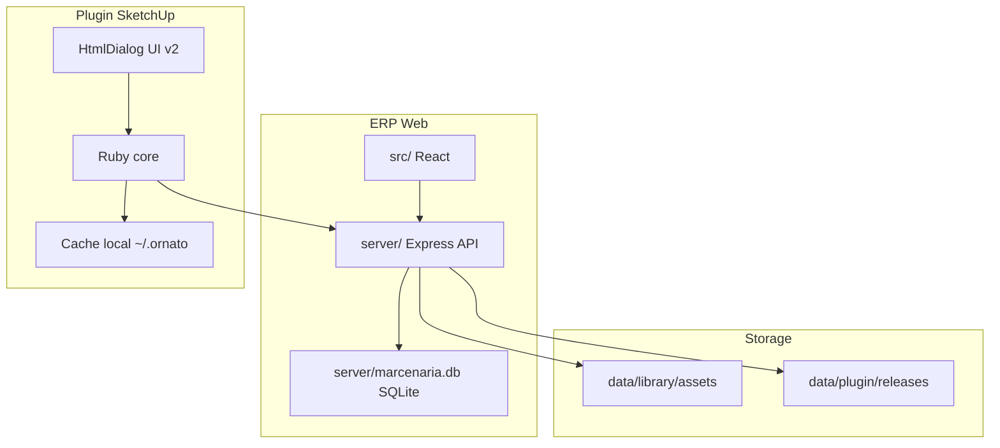

# Arquitetura do monorepo Ornato

Este documento explica a estrutura geral da pasta `/Users/madeira/SISTEMA NOVO`.

## Resumo visual

```txt
/Users/madeira/SISTEMA NOVO
├── src/                       # Frontend React do ERP
├── server/                    # Backend Express, SQLite, rotas, servicos
├── public/                    # Assets publicos do frontend
├── dist/                      # Build gerado pelo Vite
├── docs/                      # Documentacao geral do ERP/produto
├── ornato-plugin/             # Plugin SketchUp atual
├── data/                      # Storage local para library/plugin releases
├── uploads/                   # Uploads gerais do ERP
├── extension/                 # Extensao auxiliar de navegador
├── cnc/                       # Plugin antigo/referencia
├── cnc_optimizer/             # Otimizador/experimentos Python
├── design-system/             # Referencias visuais
├── ref-sistema-antigo/        # Sistema antigo preservado como referencia
└── .sistema-antigo/           # Outra copia/referencia do legado
```

## O que e atual e o que e referencia

| Pasta | Status | Observacao |
|---|---|---|
| `src/` | Atual | Frontend principal do ERP. |
| `server/` | Atual | Backend/API principal. |
| `ornato-plugin/` | Atual | Plugin SketchUp consolidado. |
| `data/` | Atual/suporte | Storage local de biblioteca e releases. |
| `cnc/sketchup-plugin/` | Referencia/legado | Plugin mais antigo, nao confundir com o atual. |
| `ref-sistema-antigo/` | Referencia | Sistema antigo para consulta. |
| `.sistema-antigo/` | Referencia | Copia legada. |
| `cnc_optimizer/` | Suporte/experimento | Otimizador separado. |

## Como as partes conversam



## Stack tecnica

| Camada | Tecnologia |
|---|---|
| Frontend ERP | React 18, Vite, lucide-react, Three.js, Zustand |
| Backend ERP | Node.js, Express, better-sqlite3, JWT, multer, WebSocket |
| Banco | SQLite local em `server/marcenaria.db` |
| Plugin | Ruby do SketchUp, HtmlDialog, SketchUp API |
| UI plugin | HTML/CSS/JS vanilla sem build |
| Biblioteca | JSON parametricos, arquivos `.skp`, materiais `.skm` |
| Deploy | Hostinger/VPS, build Vite servido pelo Express |

## Scripts principais

No ERP, rodar na raiz:

```bash
cd "/Users/madeira/SISTEMA NOVO"
npm run dev
npm run build
npm run start
```

No plugin, rodar:

```bash
cd "/Users/madeira/SISTEMA NOVO/ornato-plugin"
bash tools/ci.sh
./build.sh
```

UI v2 do plugin sem SketchUp:

```bash
cd "/Users/madeira/SISTEMA NOVO/ornato-plugin/ornato_sketchup/ui/v2"
python3 -m http.server 8765
```

Abrir:

```txt
http://localhost:8765/preview.html
```

## Arquivos de entrada

| Area | Arquivo de entrada |
|---|---|
| Frontend ERP | `src/main.jsx`, `src/App.jsx` |
| API ERP | `server/index.js` |
| Banco | `server/db.js`, `server/migrations/*.sql` |
| Auth | `server/auth.js`, `src/auth.jsx` |
| Plugin SketchUp | `ornato-plugin/ornato_loader.rb` |
| Plugin Ruby principal | `ornato-plugin/ornato_sketchup/main.rb` |
| UI plugin v2 | `ornato-plugin/ornato_sketchup/ui/v2/panel.html`, `app.js` |
| Bridge Ruby/JS | `ornato-plugin/ornato_sketchup/ui/dialog_controller.rb` |
| Biblioteca cloud API | `server/routes/library.js` |
| Auto-update plugin API | `server/routes/plugin.js` |
| Padroes marcenaria API | `server/routes/shop.js` |

## Principio de organizacao

O sistema esta centralizado, mas nao misturado:

1. O ERP fica na raiz.
2. O plugin fica em `ornato-plugin/`.
3. O backend serve APIs que o plugin consome.
4. O plugin nao acessa o SQLite direto.
5. O frontend React nao chama Ruby direto.
6. A biblioteca deve ser gerenciada por API/storage, nao por caminhos hardcoded.
