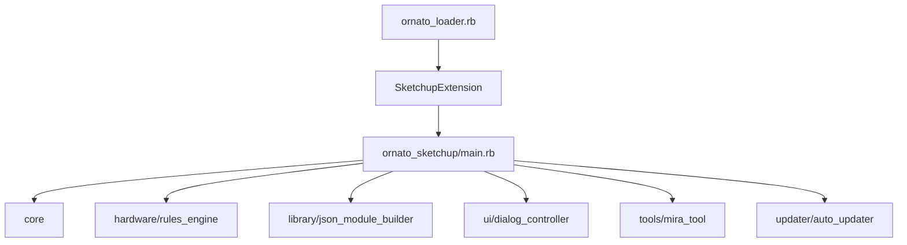
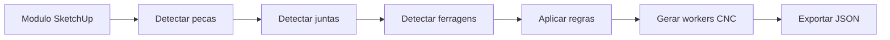

# Plugin SketchUp Ornato

Este documento explica o plugin SketchUp atual, que fica em `ornato-plugin/`.

## Resumo simples

O plugin e uma extensao Ruby para SketchUp com uma interface HTML interna. Ele transforma desenho 3D em informacao tecnica de producao: pecas, materiais, ferragens, usinagens, validacao e exportacao.

Pasta:

```txt
/Users/madeira/SISTEMA NOVO/ornato-plugin
```

## Estrutura principal

```txt
ornato-plugin/
├── ornato_loader.rb                 # loader registrado no SketchUp
├── ornato_sketchup/
│   ├── main.rb                      # carrega modulos, menus, toolbar, observers
│   ├── config.rb                    # configuracoes locais
│   ├── core/                        # analise do modelo
│   ├── hardware/                    # regras de ferragens/usininagens
│   ├── machining/                   # interpretacao/serializacao de operacoes CNC
│   ├── export/                      # JSON/DXF/CSV/BOM/API
│   ├── library/                     # biblioteca parametrica e cloud cache
│   ├── constructor/                 # construir/agregar/trocar/editar/acabamentos
│   ├── tools/                       # ferramentas interativas: mira, placement, ambiente
│   ├── ui/                          # HtmlDialogs antigos e controller
│   ├── ui/v2/                       # UI nova do plugin
│   ├── validation/                  # regras de validacao
│   ├── visual/                      # visualizacao de ferragens/overlays
│   └── updater/                     # auto-update
├── biblioteca/                      # biblioteca local JSON/SKP/SKM
├── tests/                           # testes Ruby
├── tools/                           # scripts de migracao/teste/build
└── build.sh                         # gera RBZ
```

## Como o plugin carrega



Entrada real:

| Arquivo | Papel |
|---|---|
| `ornato_loader.rb` | Registra a extensao no SketchUp. |
| `ornato_sketchup/core/version.rb` | Define versao dinamica. |
| `ornato_sketchup/main.rb` | Carrega todos os modulos e expõe a extensao. |
| `ornato_sketchup/ui/dialog_controller.rb` | Ponte entre Ruby e HtmlDialog. |

## UI v2 do plugin

Pasta:

```txt
ornato-plugin/ornato_sketchup/ui/v2/
```

Arquivos:

| Arquivo | Papel |
|---|---|
| `panel.html` | HTML real usado no HtmlDialog. |
| `preview.html` | Simulador para testar fora do SketchUp. |
| `styles.css` | Layout, temas, componentes. |
| `app.js` | Estado global, render, atalhos, bridge JS/Ruby. |
| `icons.js` | SVGs inline. |
| `tabs/index.js` | Registro das tabs. |
| `tabs/*.js` | Conteudo de cada tab. |

Tabs do plugin:

```txt
Projeto -> Ambiente -> Biblioteca -> Internos -> Acabamentos ->
Ferragens -> Usinagens -> Validacao -> Producao
```

Status encontrado:

| Tab | Arquivo | Observacao |
|---|---|---|
| Projeto | `tabs/projeto.js` | Ainda muito simples/placeholders. |
| Ambiente | `tabs/ambiente.js` | Ainda muito simples/placeholders. |
| Biblioteca | `tabs/biblioteca.js` | Ja tem mais estrutura. |
| Internos | `tabs/internos.js` | Ja tem mais estrutura. |
| Acabamentos | `tabs/acabamentos.js` | Ja tem mais estrutura. |
| Ferragens | `tabs/ferragens.js` | Ja tem conteudo. |
| Usinagens | `tabs/usinagens.js` | Ja tem conteudo. |
| Validacao | `tabs/validacao.js` | Ja tem UI de validacao. |
| Producao | `tabs/producao.js` | Ainda muito simples/placeholders. |

## Bridge Ruby <-> JS

Arquivo central:

```txt
ornato-plugin/ornato_sketchup/ui/dialog_controller.rb
```

Como funciona:

1. A UI chama `window.sketchup.nome_do_callback(...)`.
2. O Ruby registra callbacks com `add_action_callback`.
3. O Ruby responde chamando `execute_script("window.algumaFuncao(...)")`.

Exemplos de callbacks importantes:

| Callback JS -> Ruby | Funcao |
|---|---|
| `start_mira` | Ativa mira amarela/verde/vermelha. |
| `resolve_selection` | Resolve entidade selecionada para payload contextual. |
| `get_module_details` | Busca detalhes de um modulo. |
| `get_piece_details` | Busca detalhes de uma peca. |
| `get_aggregate_details` | Busca detalhes de um agregado. |
| `list_swaps` | Lista trocas compativeis. |
| `apply_swap` | Aplica troca de componente. |
| `get_module_machining` | Busca usinagens do modulo. |
| `add_machining_op` | Adiciona operacao manual. |
| `remove_machining_op` | Remove operacao manual. |
| `run_validation` | Roda validacao. |
| `auto_fix_issue` | Aplica correcao automatica. |
| `insert_module_from_library` | Insere modulo da biblioteca. |
| `sync_shop_config` | Sincroniza padroes da marcenaria. |
| `set_update_channel` | Troca canal dev/beta/stable. |
| `set_telemetry_enabled` | Liga/desliga telemetria. |
| `set_cloud_library` | Liga/desliga biblioteca cloud. |

Callbacks Ruby -> JS importantes:

| Callback | Funcao |
|---|---|
| `window.onSelectionChanged(payload)` | Atualiza selecao no inspector. |
| `window.onSelectionResolved(payload)` | Resultado da mira/selecao. |
| `window.onModuleDetails(data)` | Dados do modulo. |
| `window.onPieceDetails(data)` | Dados da peca. |
| `window.onAggregateDetails(data)` | Dados do agregado. |
| `window.onSwapList(data)` | Lista de trocas. |
| `window.onSwapApplied(data)` | Resultado de troca. |
| `window.setModuleMachining(data)` | Usinagens para UI. |
| `window.setValidationReport(report)` | Relatorio de validacao. |
| `window.setShopConfig(data)` | Config global. |

## Miras estilo UpMobb

Arquivos:

| Arquivo | Papel |
|---|---|
| `tools/mira_tool.rb` | Ferramenta de mira colorida. |
| `tools/selection_resolver.rb` | Converte entidade SketchUp em payload para UI. |
| `ui/dialog_controller.rb` | Ativa a mira e envia resultado para UI. |

Modos:

| Mira | Alvo | Acao |
|---|---|---|
| Amarela | Modulo ou agregado | Seleciona item grande/contextual. |
| Verde | Peca ou ferragem | Seleciona item tecnico interno. |
| Vermelha | Modulo, agregado, peca ou ferragem | Soft-delete com confirmacao. |

O `SelectionResolver` padroniza tudo em:

```txt
module | aggregate | piece | hardware | empty | invalid | unknown
```

Isso permite que a UI mostre menus contextuais, trocas, editor e permissoes conforme o que foi clicado.

## Biblioteca parametrica

Arquivo principal:

```txt
ornato-plugin/ornato_sketchup/library/json_module_builder.rb
```

Ele le JSONs de modulo/agregado e cria geometria no SketchUp. A ideia e que um novo movel possa ser criado por JSON, sem escrever Ruby especifico por movel.

Recursos:

| Recurso | Como funciona |
|---|---|
| Parametros | Usa expressoes tipo `{largura} - 2 * {espessura}`. |
| ShopConfig | Valores podem vir de `{shop.folga_porta_reta}` etc. |
| Pecas | Cada peca recebe stamp Ornato com role/material/bordas. |
| Ferragens 3D | Pode instanciar `.skp` preservando geometria/furacoes. |
| Rebuild | Pode preservar snapshot da marcenaria no modulo. |
| Agregados | Pode usar contexto de vao `{bay.largura}` etc. |

## ShopConfig - padroes da marcenaria

Arquivo:

```txt
ornato-plugin/ornato_sketchup/hardware/shop_config.rb
```

Serve para guardar padroes tecnicos por marcenaria:

| Grupo | Exemplos |
|---|---|
| Espessuras | carcaca, fundo, frente |
| Folgas | porta, gaveta, entre modulos |
| Ferragens | dobradica, corredica, puxador, minifix |
| Cavilha | diametro, profundidade, espacamento |
| Sistema 32 | offset, passo, ativo/inativo |
| Fundo | rasgo/recuo/profundidade |
| Materiais | carcaca, frente, fundo, fita |

O backend tambem tem `shop_profiles` em `server/routes/shop.js`. O plugin pode sincronizar o profile ativo pelo endpoint:

```txt
GET /api/shop/config
```

## Motor de regras e usinagens

Arquivo:

```txt
ornato-plugin/ornato_sketchup/hardware/rules_engine.rb
```

Ele aplica regras em ordem:

```txt
HingeRule
GasPistonRule
SlidingDoorRule
System32Rule
MinifixRule
ConfirmatRule
DowelRule
HandleRule
DrawerSlideRule
BackPanelRule
ShelfRule
MiterRule
LEDChannelRule
PassThroughRule
```

Fluxo:



O motor tambem entende `ferragens_auto` declarativas vindas dos JSONs da biblioteca. Isso e importante para casos como painel ripado cavilhado.

## Validacao

Arquivo:

```txt
ornato-plugin/ornato_sketchup/validation/validation_runner.rb
```

Regras carregadas:

| Regra | Ideia |
|---|---|
| `PieceWithoutMaterial` | Peca sem material. |
| `DrillingHittingBanding` | Furo pegando fita/borda. |
| `HardwareOutsideStandard` | Ferragem fora do padrao da marcenaria. |
| `AggregateWithoutHardware` | Agregado sem ferragem tecnica esperada. |
| `OfflineUnavailableModule` | Modulo cloud nao disponivel offline. |
| `ExpressionUnresolved` | Expressao parametrica sem resolver. |
| `EdgeRoleInvalid` | Papel/borda invalido. |
| `CollisionDrillings` | Colisao de furacoes. |

Schema de issue:

```txt
id, rule, severity, title, description, entity_id,
entity_path, auto_fix_available, auto_fix_action, ignore_token
```

## Exportacao

Arquivos:

| Arquivo | Funcao |
|---|---|
| `export/json_exporter.rb` | Gera JSON no formato consumido pelo CNC/ERP. |
| `export/dxf_exporter.rb` | Exporta DXF. |
| `export/csv_exporter.rb` | Exporta CSV/listas. |
| `export/bom_exporter.rb` | Lista de materiais/ferragens. |
| `export/api_sync.rb` | Sincronizacao com API. |

O JSON exportado tem blocos como:

```txt
details_project
model_entities
machining
```

## Biblioteca cloud no plugin

Arquivo:

```txt
ornato-plugin/ornato_sketchup/library/library_sync.rb
```

Responsabilidades:

| Funcao | Detalhe |
|---|---|
| Manifest | Baixa `/api/library/manifest`. |
| Cache | Salva em `~/.ornato/library/cache`. |
| Asset lazy | Baixa `.skp`, `.json`, `.png` sob demanda. |
| SHA-256 | Verifica integridade pelo header `Content-SHA256`. |
| LRU | Limite padrao 500 MB. |
| Search | Delegado para `/api/library/search`. |
| Offline | Usa o que ja esta em cache. |

## Auto-update

Arquivo:

```txt
ornato-plugin/ornato_sketchup/updater/auto_updater.rb
```

Recursos:

| Recurso | Detalhe |
|---|---|
| Canais | `dev`, `beta`, `stable`. |
| Check | `/api/plugin/check-update`. |
| Download | `.rbz` pelo endpoint `/api/plugin/download`. |
| Integridade | SHA-256. |
| Force update | Bloqueia versoes incompativeis quando necessario. |
| min_compat | Garante compatibilidade minima. |
| Backup | Backup pre-install em `~/.ornato/backups`. |
| Telemetria | Opt-in, default off ate decisao do usuario. |

## Testes do plugin

Runner:

```bash
cd "/Users/madeira/SISTEMA NOVO/ornato-plugin"
bash tools/ci.sh
```

O runner:

1. Roda `ruby -c` nos arquivos Ruby.
2. Roda `ruby tests/run_all.rb`.

Testes cobrem:

| Area | Exemplos |
|---|---|
| Usinagem | `drilling_collision_detector_test.rb`, `ferragem_drilling_collector_test.rb` |
| Regras | `rules_engine_test.rb` |
| Biblioteca | `library_sync_test.rb`, `parametric_engine_test.rb` |
| ShopConfig | `shop_config_sync_test.rb`, `shop_overrides_test.rb` |
| Miras | `mira_tool_test.rb`, `selection_resolver_test.rb` |
| Trocas/edicao | `swap_engine_test.rb`, `component_editor_test.rb` |
| Validacao | `validation_runner_test.rb` |
| E2E | `e2e/upm_to_gcode_test.rb`, `e2e/shop_reflow_test.rb`, `e2e/mira_placement_logic_test.rb` |
