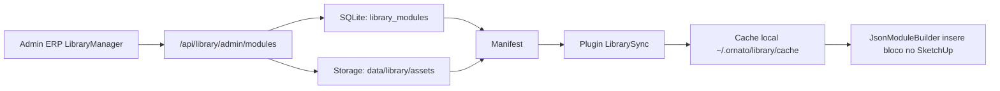

# Biblioteca cloud, blocos e WPS

Este documento explica a biblioteca de blocos do Ornato: onde ela fica hoje, como o plugin deve baixar blocos online, como editar/publicar blocos e como aproveitar a biblioteca WPS com cuidado.

## Resumo simples

A biblioteca e o catalogo tecnico usado pelo plugin. Ela contem:

| Tipo | Exemplo |
|---|---|
| Modulos | Balcao, aereo, torre, corpo, gaveteiro. |
| Agregados | Prateleira, gaveteiro interno, painel ripado, divisor. |
| Ferragens | Dobradiças, corredicas, cavilhas, puxadores. |
| Materiais | MDF, vidro, metal, SKM. |
| Bordas | Fitas e codigos BOR. |
| SKP 3D | Componentes SketchUp preservando geometrias/furacoes. |

## Onde esta hoje

| Local | Conteudo |
|---|---|
| `ornato-plugin/biblioteca/` | Biblioteca local atual usada pelo plugin e migracoes. |
| `ornato-plugin/wps_source/` | Fonte WPS comprada para estudo/migracao. |
| `data/library/` | Storage local previsto para biblioteca cloud do ERP. |
| `server/routes/library.js` | API cloud nova. |
| `src/pages/admin/LibraryManager.jsx` | Tela admin de curadoria. |
| `ornato-plugin/ornato_sketchup/library/library_sync.rb` | Cliente Ruby que baixa manifest/assets. |

## Numeros encontrados na auditoria

| Pasta | Tamanho / arquivos |
|---|---|
| `ornato-plugin/biblioteca/` | 554 MB |
| `ornato-plugin/biblioteca/` | 598 JSON, 774 SKP, 105 SKM |
| `ornato-plugin/wps_source/` | 1.1 GB |
| `ornato-plugin/wps_source/` | 11 XML, 64 WCTR, 3 SKP, milhares de arquivos adicionais |
| `data/` | 4.4 MB no momento da auditoria |

## Arquitetura esperada



## Fluxo do usuario no plugin

1. Abre SketchUp.
2. Plugin autentica ou usa token salvo.
3. `LibrarySync` baixa o manifest.
4. A UI mostra os modulos.
5. Usuario arrasta/clica em um modulo.
6. Plugin verifica cache local.
7. Se nao existir, baixa o `.json` e `.skp` via `/api/library/asset/:id`.
8. Verifica SHA-256.
9. Insere no SketchUp.
10. Regras geram ferragens/usinagens.

## Fluxo do curador/admin

1. Abre ERP.
2. Vai em `Biblioteca - Curadoria`.
3. Faz upload de JSON, SKP e thumbnail.
4. Sistema valida schema.
5. Salva como rascunho ou publica em `dev`, `beta` ou `stable`.
6. Plugin de quem esta no canal correto passa a enxergar o modulo.

## Endpoints cloud

Arquivo: `server/routes/library.js`.

### Consumo pelo plugin

| Endpoint | Quem chama | Funcao |
|---|---|---|
| `GET /api/library/manifest?since=...` | Plugin | Catalogo incremental. |
| `GET /api/library/asset/:id` | Plugin | Baixa JSON/SKP/thumbnail. |
| `GET /api/library/search` | Plugin/UI | Busca online. |
| `GET /api/library/autocomplete` | Plugin/UI | Sugestoes. |
| `GET /api/library/filters` | Plugin/UI | Facets/filtros. |

### Administracao

| Endpoint | Funcao |
|---|---|
| `GET /api/library/admin/modules` | Lista modulos. |
| `GET /api/library/admin/modules/:id` | Detalhe do modulo. |
| `POST /api/library/admin/modules` | Cria modulo. |
| `PUT /api/library/admin/modules/:id` | Atualiza modulo. |
| `PATCH /api/library/admin/modules/:id/publish` | Publica canal/status. |
| `DELETE /api/library/admin/modules/:id` | Remove/deprecia. |
| `POST /api/library/admin/validate` | Valida pacote. |
| `POST /api/library/admin/modules/:id/checkout` | Bloqueia edicao. |
| `POST /api/library/admin/modules/:id/heartbeat` | Mantem lock ativo. |
| `POST /api/library/admin/modules/:id/release` | Solta lock. |
| `POST /api/library/admin/modules/:id/checkin` | Salva nova versao. |
| `GET /api/library/admin/modules/:id/versions` | Historico. |
| `POST /api/library/admin/modules/:id/rollback/:version_id` | Rollback. |
| `GET /api/library/admin/modules/:id/export.zip` | Exporta pacote. |
| `POST /api/library/admin/import` | Importa pacote. |
| `POST /api/library/admin/modules/:id/duplicate-for-shop` | Varia bloco para uma marcenaria. |
| `GET /api/library/admin/origin-updates` | Lista updates da origem global. |
| `POST /api/library/admin/origin-updates/:id/apply` | Aplica update na variacao. |
| `POST /api/library/admin/origin-updates/:id/dismiss` | Ignora update. |

## Tabelas principais

| Tabela | Funcao |
|---|---|
| `library_modules` | Registro atual de cada modulo. |
| `library_meta` | Versao global da biblioteca. |
| `library_modules_fts` | Busca full-text. |
| `library_versions` | Historico de versoes. |
| `library_locks` | Checkout/lock com TTL. |
| `library_audit` | Auditoria de edicoes. |
| `library_origin_updates` | Atualizacoes pendentes de origem global para variacoes privadas. |

## Variacao por marcenaria

Este e um diferencial importante.

Um bloco global pode ser duplicado para uma marcenaria e virar uma variacao privada. Exemplo:

```txt
Global: balcao_2_portas v1.0.0
Empresa 17: balcao_2_portas_custom_studio v1.0.0, derived_from=balcao_2_portas
```

Quando o bloco global muda, o sistema registra update pendente em `library_origin_updates`. A marcenaria pode aplicar ou ignorar.

## Padroes tecnicos dentro dos blocos

Os JSONs podem usar valores da marcenaria:

```json
{
  "default": "{shop.folga_porta_reta}"
}
```

Exemplos de chaves:

| Chave | Uso |
|---|---|
| `{shop.espessura}` | Espessura padrao. |
| `{shop.material_carcaca_padrao}` | Material padrao de carcaca. |
| `{shop.material_frente_padrao}` | Material padrao de frente. |
| `{shop.cavilha_diametro}` | Diametro da cavilha. |
| `{shop.cavilha_profundidade}` | Profundidade da cavilha. |
| `{shop.folga_porta_reta}` | Folga de porta reta. |

## Exemplo: painel ripado cavilhado

Arquivo:

```txt
ornato-plugin/biblioteca/agregados/painel_ripado_cavilhado.json
```

Ele permite:

| Parametro | O que controla |
|---|---|
| `largura_ripa` | Largura de cada ripa. |
| `espessura_ripa` | Espessura da ripa. |
| `espacamento` | Espaco entre ripas. |
| `material_painel` | Material do painel base. |
| `material_ripa` | Material das ripas. |
| `diametro_cavilha` | Diametro vindo do ShopConfig. |
| `profundidade_cavilha` | Profundidade vinda do ShopConfig. |
| `n_cavilhas_por_ripa` | Quantidade vertical de cavilhas. |

Logica tecnica:

1. Cria painel base.
2. Repete ripas no eixo X.
3. Calcula quantidade de ripas por largura do vao.
4. Cria cavilhas espelhadas entre painel e ripa.
5. Usa a cavilha como gabarito de montagem e como usinagem CNC.

## Contrato de usinagem em blocos

Todo bloco novo deve descrever a geometria real da usinagem, nao apenas o nome da ferragem. Isso evita o erro de uma tela mostrar uma coisa e o G-code gerar outra.

| Caso | Campos esperados |
|---|---|
| Fresamento aberto | `path` ou `positions_origin` com pontos em ordem. |
| Rebaixo fechado | `close: "1"`, `depth` menor que 90% da espessura e pontos do contorno. Se existir um recorte passante fechado dentro, o motor considera como ilha/furo interno para fazer moldura/anel. |
| Recorte passante | `close: "1"`, `depth` passante e pontos do contorno. |
| Contorno externo organico | `close: "1"`, `depth` passante e caminho fechado encostando nos quatro limites da peca. O motor interpreta como silhueta final, nao como furo interno. |
| Rasgo reto | `pos_start_for_line`, `pos_end_for_line`, `width_line`, `depth`. |
| Rasgo T / cava composta | `shape: "t_slot"`, `slot_width`, `slot_length`, `head_width`, `head_depth`, `axis`, `edge`, `depth`. |

Exemplo generico de rasgo T usado por suporte invisivel, mas valido para qualquer ferragem com cava composta:

```json
{
  "tipo": "rasgo",
  "categoria": "transfer_slot",
  "shape": "t_slot",
  "axis": "y",
  "edge": "y_min",
  "slot_width": 20,
  "slot_length": 160,
  "head_width": 56,
  "head_depth": 28,
  "depth": 5.5,
  "tool_code": "f_12mm",
  "lado": "b",
  "posicao": { "x": "{dist}", "y": "{recuo_traseiro}" }
}
```

O ERP/Pre-corte deve ler esse contrato para preview 2D, preview 3D, G-code, simulador e DXF. Nao criar excecao do tipo "se for suporte invisivel"; a ferragem apenas usa um shape generico.

## Cuidados com a biblioteca WPS

A pasta WPS foi comprada para estudo/migracao. Antes de servir essa biblioteca diretamente para clientes pelo ERP, precisa haver decisao clara:

| Pergunta | Por que importa |
|---|---|
| A licenca permite redistribuir SKP/JSON derivados? | Evita risco juridico. |
| Podemos usar como referencia interna e remodelar Ornato? | Caminho mais seguro. |
| Quais arquivos sao ativos e quais sao lixo/cache? | `wps_source` tem muitos arquivos adicionais. |
| Quais usinagens devem virar regra e quais devem virar geometria preservada? | Define qualidade CNC. |

Recomendacao tecnica:

1. Usar WPS como fonte de estudo e benchmark.
2. Migrar para schema Ornato.
3. Remover dependencias de nomes/caminhos WPS.
4. Gerar JSON limpo + SKP limpo.
5. Publicar pelo `LibraryManager`, nao copiando manualmente para clientes.

## Regra para blocos novos

Um bloco Ornato bom precisa ter:

| Item | Obrigatorio |
|---|---|
| JSON parametrico | Sim |
| `id` estavel | Sim |
| `name`/`category` | Sim |
| Parametros com defaults | Sim |
| Pecas com roles | Sim |
| Materiais por parametro/shop | Sim |
| Bordas | Sim |
| Ferragens/usinagens | Sim quando aplicavel |
| SKP 3D | Sim para ferragens e componentes visuais importantes |
| Thumbnail | Recomendado |
| Teste em 16/20/24? | Para icones/UI, nao para bloco |
| Teste de exportacao CNC | Sim |
