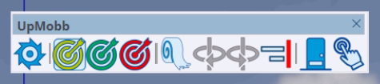
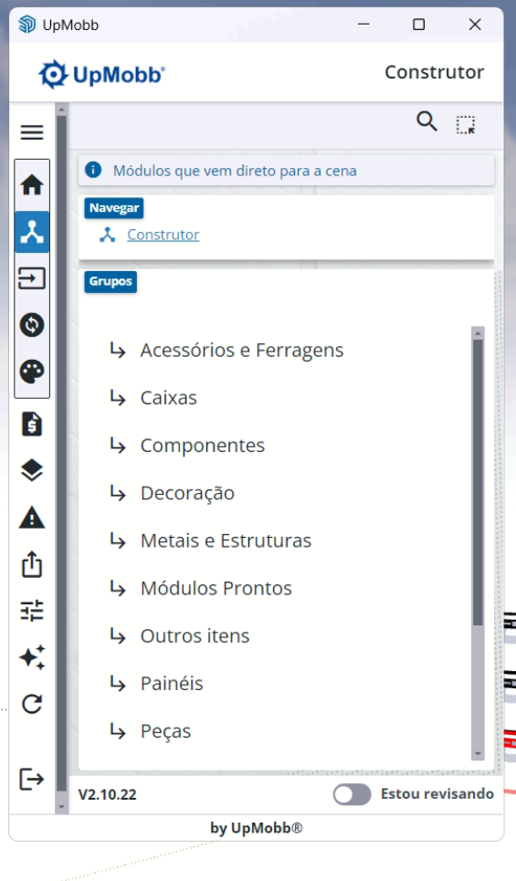
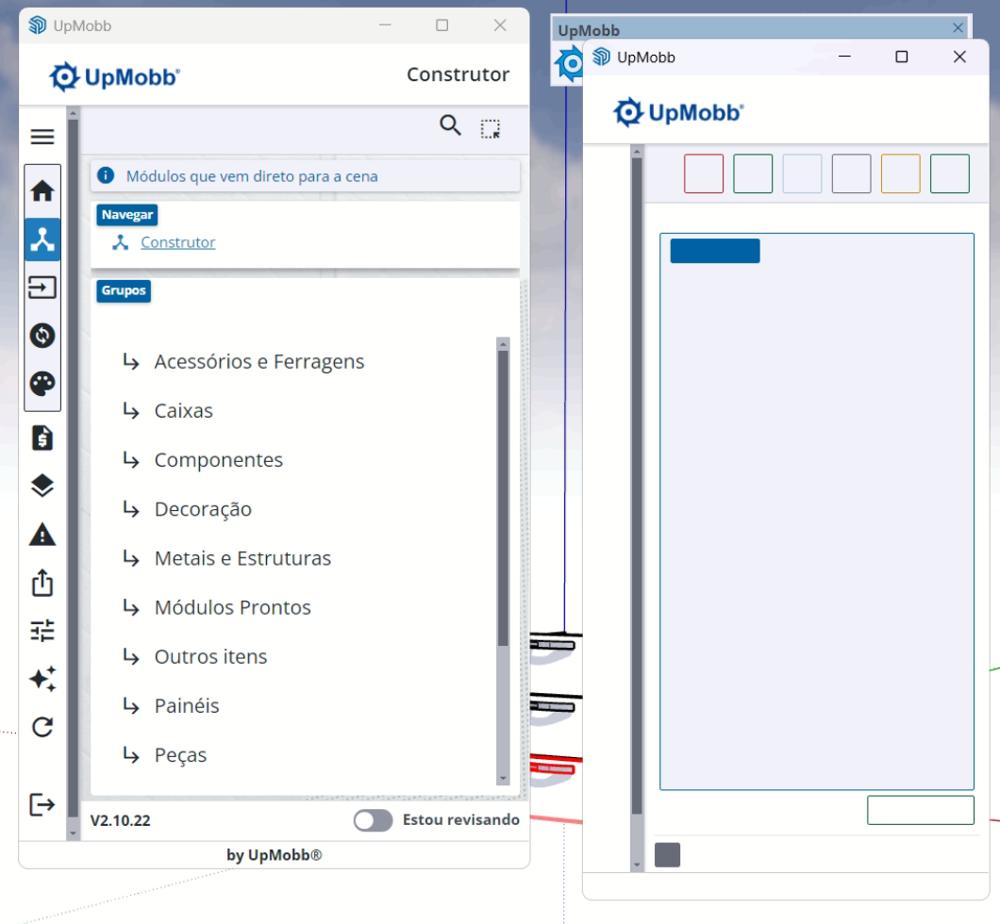
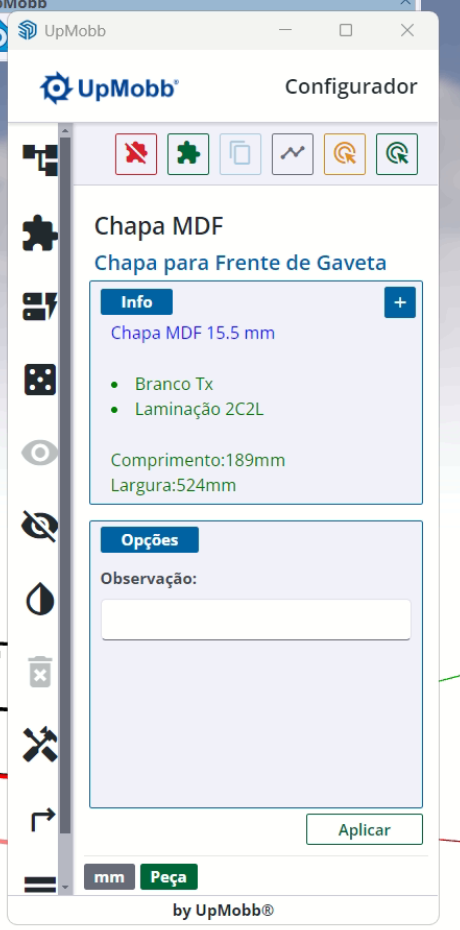
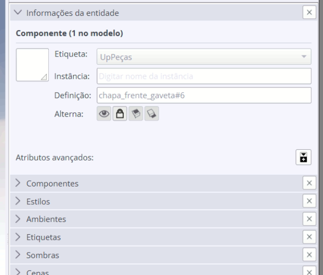
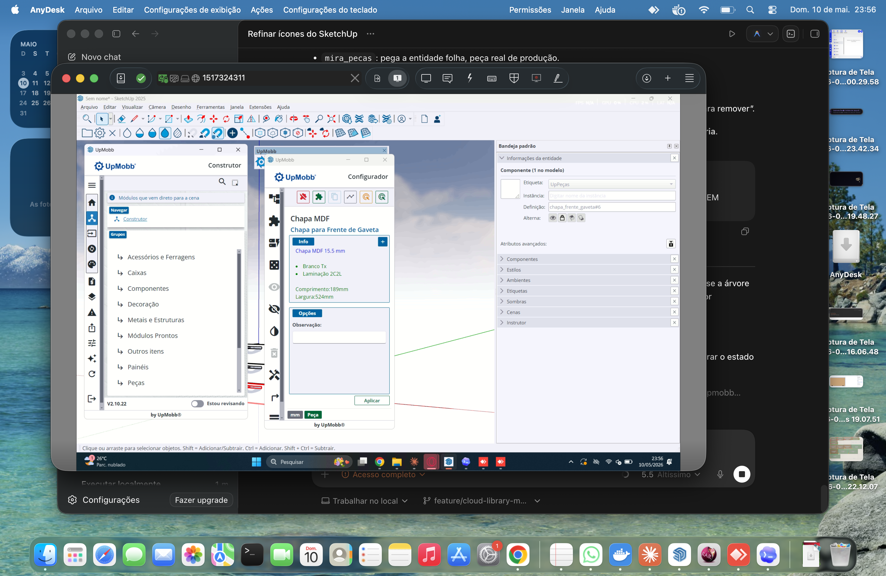
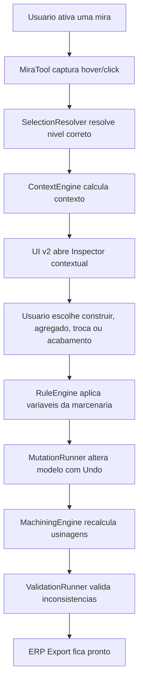

# Plano UX e Arquitetura - Miras, Menus Contextuais e Biblioteca Inteligente

Documento gerado a partir da analise operacional do fluxo do UpMobb no SketchUp, usando prints e observacao direta via AnyDesk. O objetivo nao e copiar interface, marca ou assets do UpMobb; o objetivo e entender os padroes de interacao que funcionam para marcenaria e projetar uma versao Ornato mais clara, multiplataforma, integrada ao ERP e tecnicamente conectada a pecas, ferragens, usinagens e padroes de cada marcenaria.

## 1. Resumo executivo

O fluxo observado mostra uma ideia central forte: o usuario nao trabalha apenas com geometria do SketchUp. Ele trabalha com intencao de marcenaria.

Em vez de depender somente da selecao generica do SketchUp, o sistema cria modos de selecao chamados aqui de **miras**. Cada mira seleciona um nivel diferente do movel e abre menus contextuais especificos:

- **Mira amarela**: seleciona componentes/agregados prontos e abre opcoes de edicao/troca/adicao.
- **Mira verde**: seleciona pecas fisicas individuais e abre configuracao tecnica da peca.
- **Mira vermelha**: remove itens do movel, devendo ter confirmacao e undo seguro no Ornato.

Ao lado disso, o sistema tem menus laterais por tarefa:

- **Construir**: itens que entram direto na cena.
- **Agregados**: itens para inserir em outros modulos, pecas, portas, gavetas ou paineis.
- **Trocas**: substituicoes possiveis de acordo com o item selecionado.
- **Cores/Acabamentos**: materiais e fitas aplicaveis ao contexto selecionado.

A versao Ornato deve transformar isso em uma arquitetura de biblioteca inteligente, onde cada bloco sabe onde pode entrar, quais variaveis aceita, quais pecas gera, quais usinagens cria e quais padroes da marcenaria precisa respeitar.

## 2. Evidencias visuais analisadas

### 2.1 Toolbar de miras



Leitura funcional:

- Icone de configuracao/engrenagem: acesso a funcoes gerais da ferramenta.
- Alvo amarelo: selecao de componente/agregado.
- Alvo verde: selecao de peca.
- Alvo vermelho: remocao.
- Outros botoes proximos: acoes auxiliares de orientacao, espelhamento, alinhamento, configuracao e interacao manual.

Para o Ornato, a toolbar deve ser menos densa e mais explicita. Cada modo precisa ter:

- estado ativo muito claro;
- tooltip;
- texto de status;
- cursor/realce no viewport;
- atalho de teclado;
- `Esc` para cancelar.

### 2.2 Menu Construir



O menu Construir e uma biblioteca de itens que entram direto na cena. Ele mostra grupos como:

- Acessorios e Ferragens
- Caixas
- Componentes
- Decoracao
- Metais e Estruturas
- Modulos Prontos
- Outros itens
- Paineis
- Pecas

No Ornato, esse menu deve ser tratado como **Biblioteca / Construir**. A diferenca importante e que nem todo item deve ser apenas arrastado como bloco solto. Alguns itens podem ser inseridos livres, mas outros precisam de contexto.

Exemplo:

- Um modulo de cozinha pode entrar direto na cena.
- Uma peca solta pode entrar direto na cena se for ferramenta de modelagem tecnica.
- Uma dobradica nao deve entrar solta; ela deve exigir porta + lateral.
- Um ripado pode entrar como painel livre ou como agregado aplicado sobre um painel existente.

### 2.3 Mira amarela abrindo Construtor contextual



Ao selecionar um componente/agregado, a lateral passa para **Construtor** e abre grupos de itens que podem ser adicionados, alterados ou associados ao selecionado.

Esta e a ideia que o Ornato deve absorver:

- O usuario clica em um movel pronto.
- O sistema entende que aquilo e um modulo/agregado editavel.
- A UI deixa de mostrar uma biblioteca generica e passa a mostrar opcoes compativeis com aquele item.

### 2.4 Configurador da peca



Ao selecionar uma peca, o configurador mostra informacoes tecnicas:

- tipo: Chapa MDF;
- papel funcional: Chapa para Frente de Gaveta;
- espessura: 15.5 mm;
- acabamento/material;
- laminacao;
- dimensoes;
- observacao;
- botao de aplicar.

No Ornato, isso precisa ser mais tecnico ainda, porque deve alimentar diretamente ERP, listas, etiquetas, plano de corte, validacao e CNC.

### 2.5 Informacoes da entidade no SketchUp



O SketchUp mostra a entidade como componente com tag `UpPecas` e definicao `chapa_frente_gaveta#6`.

Para o Ornato, isso aponta um requisito obrigatorio: nossas pecas precisam ser carimbadas com metadados proprios, nao depender apenas de nome visual.

Exemplo de atributos esperados:

```json
{
  "ornato.kind": "piece",
  "ornato.role": "drawer_front",
  "ornato.parent_module_id": "mod_123",
  "ornato.parent_aggregate_id": "drawer_stack_01",
  "ornato.material_code": "MDF_BRANCO_TX_15",
  "ornato.edge_profile": {
    "front": "BOR_ABS_1MM",
    "back": "none",
    "left": "BOR_ABS_1MM",
    "right": "BOR_ABS_1MM"
  }
}
```

### 2.6 Visao geral do contexto selecionado



A captura mostra tres camadas trabalhando juntas:

- painel lateral principal;
- janela configuradora contextual;
- bandeja do SketchUp com dados da entidade.

No Ornato, podemos melhorar esse desenho com uma UI mais integrada:

- lateral esquerda para navegacao;
- inspector direito para item selecionado;
- toolbar compacta de miras no topo/viewport;
- feedback visual no proprio modelo;
- comandos com undo seguro.

## 3. Modelo mental do usuario

O usuario nao pensa em "grupo", "componente" e "entidade" como o SketchUp. Ele pensa assim:

- Quero inserir um modulo.
- Quero colocar algo dentro desse modulo.
- Quero trocar a corredica desse gaveteiro.
- Quero trocar a frente da gaveta.
- Quero editar a peca.
- Quero apagar esse agregado.
- Quero aplicar acabamento.
- Quero gerar usinagens e mandar para producao.

Portanto, o Ornato precisa traduzir a hierarquia do SketchUp para linguagem de marcenaria:

| Nivel | Como o SketchUp ve | Como o usuario entende | Como o Ornato deve chamar |
|---|---|---|---|
| Projeto | modelo | projeto do cliente | projeto |
| Modulo | grupo/componente grande | armario, balcao, torre | modulo |
| Agregado | componente dentro de modulo | gaveteiro, porta, interno, ripado | agregado |
| Peca | componente/solido folha | lateral, frente, prateleira | peca |
| Ferragem | componente tecnico | dobradica, corredica, puxador | ferragem |
| Usinagem | geometria/atributo tecnico | furo, rasgo, rebaixo | usinagem |

## 4. Miras Ornato

### 4.1 Objetivo

As miras devem substituir a selecao generica por uma selecao com intencao tecnica.

Quando o usuario ativa uma mira, ele esta dizendo ao plugin:

- o que quer selecionar;
- qual profundidade da hierarquia deve ser resolvida;
- qual painel contextual deve abrir;
- quais acoes sao permitidas.

### 4.2 Mira amarela - componente/agregado

Funcao:

- selecionar modulo, agregado ou componente inteligente;
- abrir menu contextual de edicao;
- permitir inserir agregados internos;
- permitir trocas compat'iveis;
- permitir configuracao macro.

Exemplos de alvos:

- gaveteiro;
- conjunto de portas;
- painel ripado;
- modulo pronto;
- prateleira composta;
- caixa interna;
- conjunto de ferragens.

Comportamento esperado:

1. Usuario ativa a mira amarela.
2. Status mostra: `Selecione um componente ou agregado`.
3. Ao passar o mouse, o Ornato destaca o agregado candidato.
4. Ao clicar, o SelectionResolver sobe na hierarquia ate encontrar `ornato.kind = module` ou `ornato.kind = aggregate`.
5. A UI abre o inspector do agregado.
6. Menus disponiveis passam a ser filtrados por contexto.

Exemplo de contexto resolvido:

```json
{
  "selection_mode": "aggregate",
  "kind": "aggregate",
  "type": "drawer_stack",
  "name": "Gaveteiro 3 gavetas",
  "parent_module_id": "balcao_800_01",
  "allowed_actions": ["edit", "swap", "add_internal", "apply_finish", "remove"]
}
```

### 4.3 Mira verde - peca

Funcao:

- selecionar uma peca fisica individual;
- editar material, borda, observacao, roles e usinagens;
- mostrar informacoes tecnicas reais de producao.

Exemplos de alvos:

- lateral esquerda;
- base;
- topo;
- frente de gaveta;
- fundo de gaveta;
- prateleira;
- ripa;
- painel base.

Comportamento esperado:

1. Usuario ativa mira verde.
2. Status mostra: `Selecione uma peca`.
3. Hover destaca somente a peca folha.
4. Clique abre o inspector de peca.
5. Inspector mostra dimensoes, material, bordas, usinagens e origem da peca.

Dados esperados no inspector:

- nome;
- role;
- material;
- espessura;
- largura, altura, profundidade;
- bordas por face;
- lista de usinagens;
- ferragens vinculadas;
- observacoes;
- origem: manual, biblioteca, agregado, regra automatica.

### 4.4 Mira vermelha - remover

Funcao:

- remover modulo, agregado ou peca;
- evitar apagamento acidental;
- manter undo seguro.

O Ornato deve ser melhor que o padrao destrutivo simples:

1. Usuario ativa mira vermelha.
2. Hover destaca em vermelho o item removivel.
3. Primeiro clique mostra preview: `Remover gaveteiro 3 gavetas?`.
4. Confirmacao por segundo clique ou botao.
5. Operacao usa `model.start_operation("Ornato - remover agregado", true)`.
6. Todo efeito colateral e revertivel via Undo.

Se a remocao afetar usinagens vinculadas, o dialogo deve informar:

- pecas que serao removidas;
- ferragens vinculadas;
- usinagens que serao removidas;
- inconsistencias que podem surgir.

## 5. Menus laterais

### 5.1 Menu Construir

Uso:

- inserir itens diretos na cena;
- iniciar projeto com modulos;
- adicionar pecas ou componentes soltos quando permitido.

Categorias propostas para o Ornato:

| Categoria | Conteudo | Insercao |
|---|---|---|
| Modulos prontos | balcoes, aereos, torres, nichos | direto na cena |
| Caixas | estruturas parametrizadas | direto ou dentro de modulo |
| Pecas | chapas soltas, paineis, ripas | direto ou assistido |
| Paineis | painel liso, ripado, cabeceira, divisoria | direto ou sobre alvo |
| Componentes | portas, gavetas, internos, prateleiras | normalmente contextual |
| Ferragens | dobradicas, corredicas, puxadores | contextual |
| Acessorios | lixeiras, cestos, cabideiros, LED | contextual |
| Metais e estruturas | perfis, tubos, bases metalicas | direto ou contextual |
| Decoracao | itens nao produtivos ou auxiliares | direto |

Regra importante:

Todo item do Construir deve declarar se pode entrar livremente ou se exige alvo.

```json
{
  "id": "balcao_2_portas",
  "kind": "module_template",
  "category": "modulos_prontos",
  "insert_mode": "free",
  "requires_target": false
}
```

```json
{
  "id": "dobradica_caneco_35",
  "kind": "hardware_template",
  "category": "ferragens",
  "insert_mode": "contextual",
  "requires_target": true,
  "target_selector": ["door", "side_panel"]
}
```

### 5.2 Menu Agregados

Print recebido pelo Victor: menu `Agregados`, com a mensagem `Modulos para inserir em outros`.

Categorias observadas:

- Internos
- Para Gavetas
- Para Peca
- Inferiores
- Para Portas
- Externos
- Superiores
- Portas de correr
- Para Paineis

Interpretacao:

Agregado nao e bloco solto. Agregado e algo inserido dentro, fora, acima, abaixo ou associado a um alvo existente.

No Ornato, cada agregado deve ter:

- contextos aceitos;
- mira recomendada;
- variaveis;
- regras de implantacao;
- regras de folga;
- pecas geradas;
- ferragens geradas;
- usinagens geradas.

Exemplo:

```json
{
  "id": "gaveteiro_interno_3_gavetas",
  "kind": "aggregate_template",
  "category": "internos",
  "applies_to": ["module.opening", "module.internal_space"],
  "mira": "yellow",
  "requires_target": true,
  "parameters": {
    "drawer_count": 3,
    "gap_top": "{shop.gap_drawer_top}",
    "gap_between_fronts": "{shop.gap_drawer_front_between}"
  },
  "generates": ["pieces", "hardware", "machining"]
}
```

### 5.3 Menu Trocas

Print recebido pelo Victor: menu `Trocas`, com um gaveteiro selecionado.

Categorias observadas:

- Corredica Telescopica
- Fixacao Frentes
- Fixacao Gaveta
- Frente de Gaveta
- Fundos Gaveta
- Sistema Corredica

Interpretacao:

Trocas sao substituicoes contextuais. Elas aparecem de acordo com o tipo do item selecionado.

No Ornato, a regra deve ser:

- se selecionou gaveteiro, mostrar trocas de gaveta;
- se selecionou porta, mostrar dobradicas, puxadores, sistema de abertura;
- se selecionou painel ripado, mostrar tipo de ripa, espacamento, fixacao e acabamento;
- se selecionou peca, mostrar material, borda e usinagens permitidas.

Exemplo:

```json
{
  "context_type": "drawer_stack",
  "swap_groups": [
    "drawer_slide",
    "drawer_front_fixing",
    "drawer_box_fixing",
    "drawer_front",
    "drawer_bottom",
    "slide_system"
  ]
}
```

Trocar nao pode ser apenas substituir geometria. Trocar precisa recalcular:

- dimensoes das pecas;
- folgas;
- posicoes de ferragens;
- furo de corredica;
- furo de puxador;
- usinagens CNC;
- validacoes.

### 5.4 Menu Cores / Acabamentos

Print recebido pelo Victor: menu `Cores`, variando de acordo com o movel selecionado.

Categorias observadas:

- MDF
- Fitas de borda

Interpretacao:

Acabamento e tecnico, nao apenas visual. Mudar cor no Ornato deve atualizar atributos de producao.

No Ornato:

- selecionar modulo permite aplicar material em massa;
- selecionar agregado permite aplicar por subconjunto;
- selecionar peca permite aplicar material e bordas de forma precisa;
- selecionar ferragem pode mostrar acabamento metalico, quando fizer sentido.

Exemplo:

```json
{
  "context_type": "drawer_stack",
  "finish_groups": [
    {
      "id": "mdf",
      "applies_to_roles": ["drawer_front", "drawer_side", "drawer_back", "drawer_bottom"]
    },
    {
      "id": "edge_banding",
      "applies_to_roles": ["drawer_front"]
    }
  ]
}
```

## 6. Arquitetura proposta



### 6.1 Ruby

Classes propostas:

| Classe | Responsabilidade |
|---|---|
| `Ornato::Tools::MiraTool` | ferramenta interativa do SketchUp para hover/click |
| `Ornato::SelectionResolver` | resolve se a selecao e modulo, agregado, peca ou ferragem |
| `Ornato::ContextEngine` | calcula acoes disponiveis por contexto |
| `Ornato::LibraryCatalog` | carrega manifest local/cloud da biblioteca |
| `Ornato::MutationRunner` | aplica mudancas com `start_operation` e rollback |
| `Ornato::ShopConfig` | resolve variaveis por marcenaria |
| `Ornato::MachiningEngine` | gera ou atualiza usinagens |
| `Ornato::ValidationRunner` | valida resultado apos operacao |

### 6.2 JavaScript / UI v2

Estados principais:

```js
{
  activeMira: "component" | "piece" | "remove" | null,
  selectedContext: {
    kind: "module" | "aggregate" | "piece" | "hardware",
    id: "string",
    type: "string",
    allowedActions: []
  },
  sidePanel: "construir" | "agregados" | "trocas" | "acabamentos",
  inspector: {
    loading: false,
    data: {}
  }
}
```

Callbacks Ruby <-> JS:

| Callback | Direcao | Funcao |
|---|---|---|
| `ornato.setMira(mode)` | JS -> Ruby | ativa mira |
| `ornato.selectionChanged(payload)` | Ruby -> JS | informa contexto selecionado |
| `ornato.requestMenu(menuId)` | JS -> Ruby | pede menu contextual |
| `ornato.applyMutation(payload)` | JS -> Ruby | aplica troca/acabamento/insercao |
| `ornato.validateCurrentContext()` | JS -> Ruby | valida o alvo atual |

## 7. Modelo de dados minimo

### 7.1 Modulo

```json
{
  "id": "balcao_2_portas_800",
  "kind": "module",
  "type": "base_cabinet",
  "dimensions": {
    "width": 800,
    "height": 720,
    "depth": 560
  },
  "children": ["agg_gaveteiro_01", "piece_left_side", "piece_right_side"],
  "shop_profile_id": "shop_default"
}
```

### 7.2 Agregado

```json
{
  "id": "agg_gaveteiro_01",
  "kind": "aggregate",
  "type": "drawer_stack",
  "parent_module_id": "balcao_2_portas_800",
  "parameters": {
    "drawer_count": 3,
    "slide_system": "telescopic_45kg",
    "front_gap": "{shop.gap_drawer_front_between}"
  },
  "generated_piece_ids": ["piece_drawer_front_01", "piece_drawer_front_02"],
  "generated_machining_ids": ["mach_slide_hole_01"]
}
```

### 7.3 Peca

```json
{
  "id": "piece_drawer_front_01",
  "kind": "piece",
  "role": "drawer_front",
  "material": "MDF_BRANCO_TX_15",
  "edge_banding": {
    "top": "BOR_ABS_1MM",
    "bottom": "BOR_ABS_1MM",
    "left": "BOR_ABS_1MM",
    "right": "BOR_ABS_1MM"
  },
  "dimensions": {
    "width": 524,
    "height": 189,
    "thickness": 15
  }
}
```

### 7.4 Variaveis por marcenaria

Esse e um diferencial do Ornato.

```json
{
  "shop_profile_id": "marcenaria_victor",
  "variables": {
    "gap_door_straight": 3,
    "gap_door_overlay": 2,
    "gap_drawer_front_between": 3,
    "drawer_slide_lateral_clearance": 13,
    "default_mdf_thickness": 15,
    "default_back_panel_thickness": 6,
    "dowel_diameter": 8,
    "dowel_depth": 12
  }
}
```

Todo bloco deve poder usar expressao com variavel:

```json
{
  "drawer_front_width": "{opening.width} - (2 * {shop.gap_drawer_side})",
  "drawer_box_width": "{opening.width} - (2 * {shop.drawer_slide_lateral_clearance})"
}
```

## 8. Exemplo especial - Painel ripado cavilhado

O painel ripado citado no planejamento deve ser um agregado de alto valor para o Ornato.

### 8.1 Objetivo

Permitir criar um painel ripado onde o usuario personaliza:

- largura total;
- altura total;
- espessura do painel base;
- largura das ripas;
- profundidade das ripas;
- espacamento entre ripas;
- material do painel;
- material das ripas;
- diametro da cavilha;
- quantidade/posicao das cavilhas;
- regra de gabarito no painel.

### 8.2 Como entra na UI

Menu:

`Agregados > Para Paineis > Painel ripado cavilhado`

Fluxo:

1. Usuario ativa Mira Amarela.
2. Seleciona painel base ou modulo alvo.
3. Escolhe `Painel ripado cavilhado`.
4. UI abre configurador com variaveis.
5. Ornato cria ripas como pecas independentes.
6. Ornato gera cavilhas e usinagens no painel base e nas ripas.
7. Validacao confere se as cavilhas nao colidem com bordas, rasgos ou outras usinagens.

### 8.3 Schema exemplo

```json
{
  "id": "painel_ripado_cavilhado",
  "kind": "aggregate_template",
  "category": "para_paineis",
  "applies_to": ["piece.panel", "module.back_panel", "free_wall_panel"],
  "parameters": {
    "ripa_width": 30,
    "ripa_depth": 18,
    "spacing": 15,
    "dowel_diameter": "{shop.dowel_diameter}",
    "dowel_depth_panel": 10,
    "dowel_depth_ripa": 12,
    "dowel_pitch_y": 450
  },
  "generates": {
    "pieces": ["slats"],
    "hardware": ["dowels"],
    "machining": ["panel_dowel_holes", "slat_dowel_holes"]
  }
}
```

## 9. Melhorias que o Ornato deve fazer sobre o padrao observado

### 9.1 Interface mais limpa

O UpMobb tem muita informacao em janelas pequenas e muitos icones sem texto. O Ornato deve manter a densidade profissional, mas com mais clareza:

- tooltips em todos os icones;
- texto de status no rodape;
- painel unico de inspector quando possivel;
- estados de loading/erro;
- confirmacao para acoes destrutivas;
- breadcrumb claro.

### 9.2 Multiplataforma de verdade

O fluxo observado roda no Windows via AnyDesk. O Ornato deve funcionar igualmente em:

- Windows;
- macOS;
- SketchUp 2024/2025/2026 conforme suporte definido.

Regras:

- UI em `HtmlDialog`;
- Ruby puro para ferramentas SketchUp;
- sem dependencia de `.exe` local para operacoes essenciais;
- caminhos com `File.join`;
- cache em pasta correta por sistema.

### 9.3 Biblioteca cloud

A biblioteca nao deve ficar presa ao computador.

Fluxo esperado:

1. Plugin baixa manifest da biblioteca.
2. UI mostra categorias e busca.
3. `.skp` baixa sob demanda.
4. Cache local evita download repetido.
5. Admin do ERP publica modulos/agregados/trocas por canal.

### 9.4 Trocas com recalculo tecnico

Trocar uma corredica ou frente precisa recalcular tudo que depende dela.

Exemplo:

- troca corredica comum por oculta;
- altera folga lateral;
- altera largura da caixa de gaveta;
- altera furo da corredica;
- altera validacoes;
- atualiza lista de ferragens;
- exporta corretamente para ERP.

### 9.5 Validacao sempre proxima da acao

Depois de qualquer troca, acabamento ou insercao:

- rodar validacao incremental;
- indicar problemas imediatamente;
- permitir selecionar item com erro;
- sugerir auto-fix quando seguro.

## 10. Contratos de biblioteca

Todo item da biblioteca deve declarar:

```json
{
  "id": "string",
  "kind": "module_template | aggregate_template | piece_template | hardware_template | finish",
  "name": "string",
  "category": "string",
  "version": "string",
  "channel": "dev | beta | stable",
  "allowed_contexts": [],
  "required_mira": "yellow | green | none",
  "parameters_schema": {},
  "default_parameters": {},
  "shop_variables_used": [],
  "generates": {
    "pieces": [],
    "hardware": [],
    "machining": []
  },
  "swap_groups": [],
  "validation_rules": []
}
```

## 11. Regras de permissao

Como teremos upload/download/edicao de blocos:

| Acao | Permissao |
|---|---|
| usar biblioteca stable | usuario comum |
| baixar bloco para editar | modelador autorizado |
| fazer check-out de bloco | modelador autorizado |
| publicar beta | lider tecnico/design |
| publicar stable | admin/produto |
| apagar versao | admin |
| fazer rollback | admin |

O plugin deve permitir:

- baixar bloco para edicao;
- abrir no SketchUp;
- validar atributos;
- enviar de volta para o ERP;
- publicar em beta;
- promover para stable.

## 12. Roadmap sugerido

### Fase 1 - Base de selecao

- Criar `MiraTool`.
- Criar `SelectionResolver`.
- Carimbar pecas/modulos/agregados com atributos Ornato.
- Mostrar inspector read-only.

Aceite:

- mira amarela seleciona agregado;
- mira verde seleciona peca;
- UI mostra tipo, role, material e dimensoes.

### Fase 2 - Menus contextuais

- Implementar menus Construir, Agregados, Trocas e Acabamentos.
- Filtrar itens por contexto selecionado.
- Criar schemas JSON dos itens.

Aceite:

- selecionar gaveteiro mostra trocas de gaveta;
- selecionar peca mostra material/borda;
- selecionar painel mostra agregados para painel.

### Fase 3 - Mutacoes seguras

- Aplicar troca de material.
- Aplicar troca de borda.
- Aplicar troca simples de ferragem.
- Garantir Undo.

Aceite:

- toda acao usa `start_operation`;
- undo restaura estado;
- validacao roda apos aplicar.

### Fase 4 - Agregados inteligentes

- Gaveteiro interno.
- Prateleira/divisoria.
- Porta com dobradica.
- Painel ripado cavilhado.

Aceite:

- agregado cria pecas reais;
- usinagens sao geradas;
- lista de producao muda corretamente.

### Fase 5 - Cloud e edicao de biblioteca

- Manifest cloud.
- Download lazy.
- Cache LRU.
- Check-out/check-in.
- Publicacao beta/stable.

Aceite:

- plugin abre rapido;
- biblioteca sincroniza sem travar;
- bloco editado volta para banco com versao.

## 13. Checklist de implementacao

Antes de considerar pronto:

- [ ] Miras funcionam no Windows e macOS.
- [ ] Mira vermelha tem confirmacao.
- [ ] Todo item selecionavel tem `ornato.kind`.
- [ ] Todo agregado sabe seu modulo pai.
- [ ] Toda peca sabe seu role e material.
- [ ] Toda troca recalcula dependencias.
- [ ] Acabamento altera atributo tecnico, nao apenas textura.
- [ ] Usinagens sao vinculadas a peca e origem.
- [ ] Validacao roda apos mutacao.
- [ ] Undo funciona em todas as acoes.
- [ ] Biblioteca cloud tem hash/versao.
- [ ] Admin consegue publicar beta/stable.

## 14. Decisao de produto

O Ornato deve adotar a ideia de menus e miras, mas com uma camada tecnica mais forte:

- UpMobb parece resolver fluxo de uso.
- Ornato precisa resolver fluxo de uso + producao + ERP + CNC + padrao por marcenaria.

A frase guia:

> O usuario seleciona com intencao; o Ornato responde com contexto tecnico.

Esse sistema de miras e menus deve virar o centro da experiencia do plugin SketchUp.
